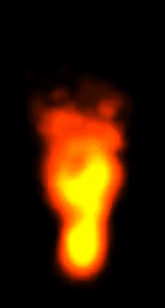

# regl-fire

Cheap-looking fire particle system implemented with [regl](https://github.com/mikolalysenko/regl).

[Demo here](https://erkaman.github.io/regl-fire/fire.html)



# Implementation Details

The fire is rendered as a particle system of about 300 particles. It
turns out that only 300 particles can result in a significant amount of
overdraw, and this will cause poor performance on lower-end graphics
cards.

But I solved this problem by rendering the particle system to an FBO
that is about one-fifth the size of the screen, and then upscaling and
rendering it to the actual screen. Since then less fragments are
processed, the overhead from all the overdraw for the fragments is
significantly reduced.

This technique is called off-screen particles, and you can read more
about it [in this article](http://http.developer.nvidia.com/GPUGems3/gpugems3_ch23.html)

# Build

```bash
npm install
```

To then run the demo, do

```bash
npm run start
```

To run the test cases, do

```bash
npm run test
```
